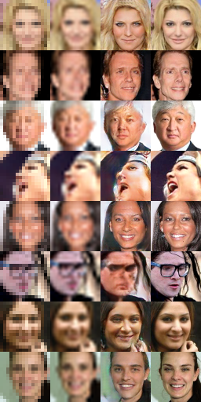

# srez
Image super-resolution through deep learning. This project uses deep learning to upscale 16x16 images by a 4x factor. The resulting 64x64 images display sharp features that are plausible based on the dataset that was used to train the neural net.

Here's an example of what this network can do. From left to right, the first column is the 16x16 input image, the second column is what you would get from a standard bicubic interpolation, the third column is the output generated by the neural net, and the rightmost column is the ground truth.

As you can see, the network is able to produce a very plausible reconstruction of the original face.

# How it works

In essence the architecture is a DCGAN where the input to the generator network is the 16x16 image rather than a multinomial gaussian distribution.

In addition to that the loss function has a term that measures the L1 difference between the 16x16 input and dowscaled version of the image produced by the generator.

The adversarial term of the loss function takes care of producing sharp features while the L1 term ensures that the output produced by the generator is a plausible reconstruction of the input image. We have found that this L1 term greatly accelerates the convergence of the network during the first batches, and also appears to prevent the generator from getting stuck in a poor local solution.

Finally, the generator network relies on ResNet modules, as we've found them to train substantially faster than more old-fashioned architectures. The adversarial network is much simpler as the use of ResNet modules did not provide an advantage during our experimentation.

# How to obtain the dataset

[Large-scale CelebFaces Attributes (CelebA) Dataset](http://mmlab.ie.cuhk.edu.hk/projects/CelebA.html). Download zip file titled `Align&Cropped Images` and extract all images to a subfolder named `dataset`. I.e. `srez/dataset/lotsoffiles.jpg`.

